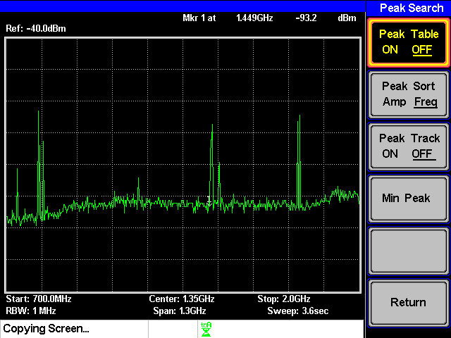
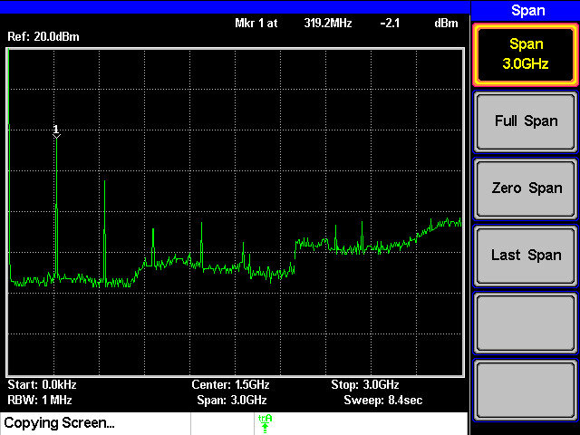
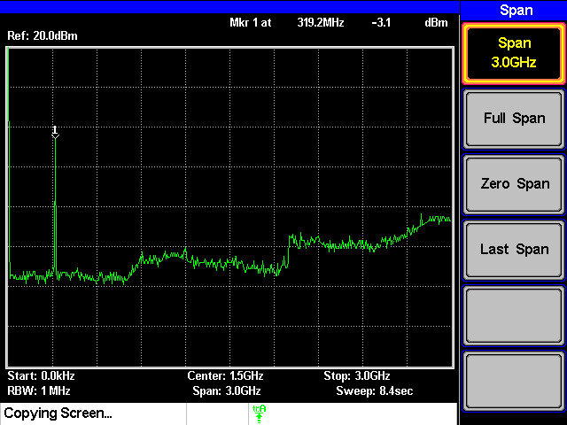
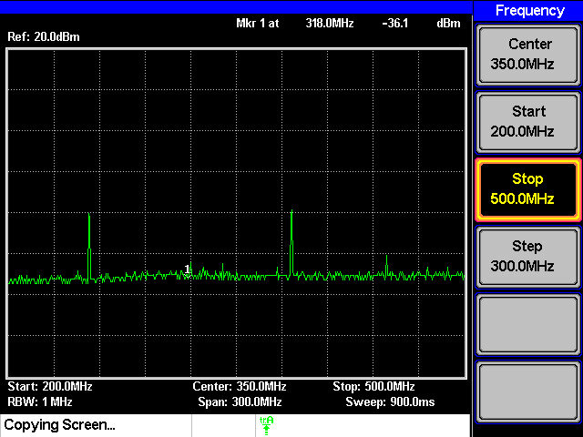
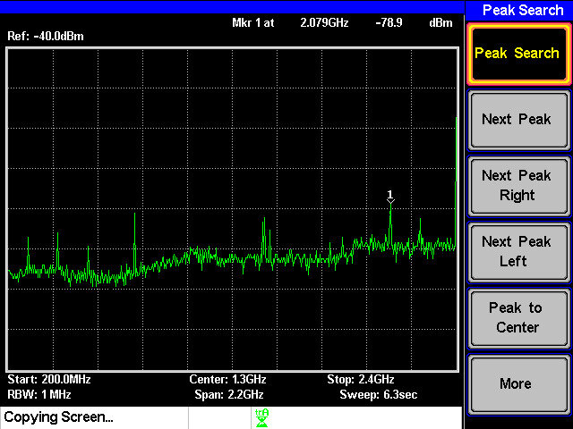

## 3IXX  

# AM変調

## 課題
1. 各自が使用している携帯電話の使用周波数を，スペクトラム・アナライザを用いて確認せよ(結果は，周波数のみ示せばよい)。

### 結果

周波数は1.449[GHz]だった

### 画像

2. 信号発生器(XCO0320)の出力波形の周波数スペクトルおよび，それにバンドパスフィルタ(BPF0320)を付けた場合の出力を，スペアナで観測する．

### 結果

以下の画像のようになった

- 信号発生器の出力波形

- バンドパスフィルタをつけた場合

3. 一段目のミキサ(MIX0400u)までを組み立て，その出力の周波数スペクトルをスペアナで観測せよ

### 結果

以下の画像のようになった

4. 送信側のモジュールを完成させ，スペアナでアンテナからの送信波の周波数スペクトルを確認せよ

### 結果

周波数は [Hz]だった

- 画像

1. AM変調の送受信実験を行う

## 考察

> 各モジュールの入力前後でスペアナの出力(周波数スペクトル)がどのように変わるかに注目して，各モジュールの働きについて理解すること。

とあるのでこのことについて言えばよい。

AM変調・復調の実験を通じ、搬送波や側波帯がどのように信号を伝送する役割を果たすかを具体的に理解できました。また、スペクトラム・アナライザを用いて周波数スペクトルを観測することで、理論通りの結果を確認し、フィルタやミキサの役割も学びました。さらに、信号処理が正確な通信に不可欠であることに気づきました。この実験を通じて、AM変調技術が現代の通信技術の基盤となる重要性を実感することができました。